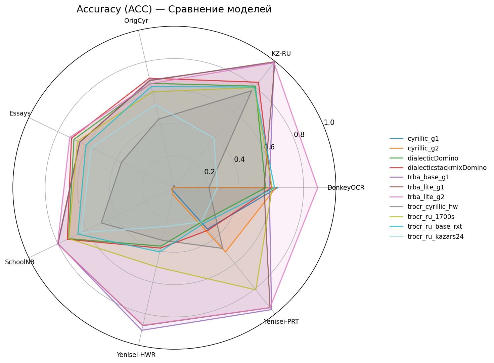
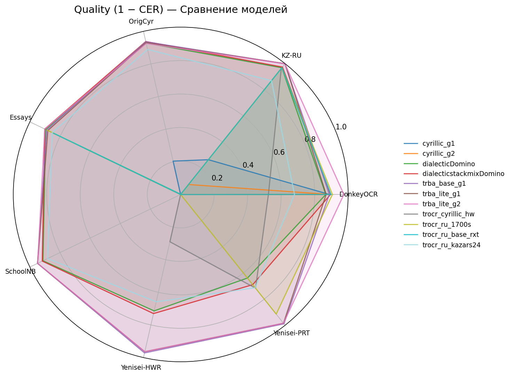

# 🏆 AzbukaBoard — Cyrillic Handwriting OCR Leaderboard

Benchmark для оценки моделей распознавания кириллического рукописного текста.

## 📊 Comparison Charts

### Accuracy Radar

### 1-CER Radar

---

## Dataset: DonkeySmallOCR-Numbers-Printed-15random

**Homepage:** [https://disk.yandex.ru/d/gyWrRxdBGJgKlQ](https://disk.yandex.ru/d/gyWrRxdBGJgKlQ)

**Author:** DonkeySmall

| Rank | Model | CER ↓ | WER ↓ | ACC ↑ | Avg Rank |
|------|-------|-------|-------|-------|----------|
| 1 | trba_lite_g2 | 0.0256 | 0.1133 | 0.8873 | 1.00 |
| 2 | cyrillic_g1 | 0.1118 | 0.4327 | 0.6393 | 3.33 |
| 3 | trocr_ru_1700s | 0.0940 | 0.4513 | 0.6053 | 3.67 |
| 4 | dialecticstackmixDomino | 0.1051 | 0.4353 | 0.6007 | 4.33 |
| 5 | trocr_ru_base_rxt | 0.1030 | 0.5020 | 0.6200 | 5.00 |
| 6 | cyrillic_g2 | 0.1086 | 0.5100 | 0.6280 | 5.67 |
| 7 | trba_base_g1 | 0.1126 | 0.4527 | 0.5873 | 6.33 |
| 8 | dialecticDomino | 0.1332 | 0.4580 | 0.5647 | 7.67 |
| 9 | trba_lite_g1 | 0.1314 | 0.4667 | 0.5553 | 8.00 |
| 10 | trocr_ru_kazars24 | 0.3205 | 0.7473 | 0.2660 | 10.00 |
| 11 | trocr_cyrillic_hw | 0.4762 | 1.1200 | 0.2133 | 11.00 |

---

## Dataset: HandwrittenKazakhRussian

| Rank | Model | CER ↓ | WER ↓ | ACC ↑ | Avg Rank |
|------|-------|-------|-------|-------|----------|
| 1 | trba_lite_g1 | 0.0002 | 0.0010 | 0.9983 | 1.00 |
| 2 | trba_base_g1 | 0.0013 | 0.0064 | 0.9898 | 2.00 |
| 3 | trba_lite_g2 | 0.0013 | 0.0066 | 0.9894 | 2.67 |
| 4 | dialecticstackmixDomino | 0.0259 | 0.1124 | 0.8351 | 4.00 |
| 5 | dialecticDomino | 0.0314 | 0.1388 | 0.8045 | 5.67 |
| 6 | trocr_ru_1700s | 0.0311 | 0.1399 | 0.7935 | 6.00 |
| 6 | trocr_ru_base_rxt | 0.0311 | 0.1442 | 0.7970 | 6.00 |
| 8 | trocr_cyrillic_hw | 0.0367 | 0.1567 | 0.7682 | 8.00 |
| 9 | trocr_ru_kazars24 | 0.1303 | 0.4822 | 0.3939 | 9.00 |
| 10 | cyrillic_g1 | 0.7344 | 1.2342 | 0.0019 | 10.00 |
| 11 | cyrillic_g2 | 0.9240 | 1.7398 | 0.0011 | 11.00 |

---

## Dataset: RussianSchoolEssays

**Homepage:** [https://data.mendeley.com/datasets/vs44v8r3nf/1](https://data.mendeley.com/datasets/vs44v8r3nf/1)

**Author:** Oleg Bakhteev , Rita Kuznetsova , Andrey Khazov , Aleksandr Ogaltsov , Kamil Safin , Tatyana Gorlenko , Marina Suvorova , Andrey Ivahnenko , Pavel Botov , Yury Chekhovich

**License:** CC BY NC 3.0

| Rank | Model | CER ↓ | WER ↓ | ACC ↑ | Avg Rank |
|------|-------|-------|-------|-------|----------|
| 1 | trba_lite_g2 | 0.0986 | 0.2895 | 0.7187 | 1.00 |
| 2 | dialecticstackmixDomino | 0.0987 | 0.3030 | 0.7071 | 2.00 |
| 3 | dialecticDomino | 0.1046 | 0.3169 | 0.6899 | 3.00 |
| 4 | trocr_ru_1700s | 0.1147 | 0.3540 | 0.6655 | 4.33 |
| 5 | trba_base_g1 | 0.1113 | 0.3590 | 0.6492 | 5.00 |
| 6 | trba_lite_g1 | 0.1191 | 0.3617 | 0.6508 | 5.67 |
| 7 | trocr_ru_kazars24 | 0.1476 | 0.4427 | 0.5718 | 7.33 |
| 8 | trocr_ru_base_rxt | 0.1563 | 0.4580 | 0.6080 | 7.67 |
| 9 | trocr_cyrillic_hw | 0.3312 | 0.7123 | 0.3634 | 9.00 |
| 10 | cyrillic_g1 | 1.0165 | 1.1507 | 0.0044 | 10.00 |
| 11 | cyrillic_g2 | 1.0568 | 1.7248 | 0.0042 | 11.00 |

---

## Dataset: YeniseiGovReports-HWR

| Rank | Model | CER ↓ | WER ↓ | ACC ↑ | Avg Rank |
|------|-------|-------|-------|-------|----------|
| 1 | trba_base_g1 | 0.0284 | 0.1009 | 0.9054 | 1.00 |
| 2 | trba_lite_g1 | 0.0359 | 0.1306 | 0.8756 | 2.00 |
| 3 | trba_lite_g2 | 0.0366 | 0.1339 | 0.8732 | 3.00 |
| 4 | dialecticstackmixDomino | 0.2697 | 0.6559 | 0.3834 | 5.00 |
| 5 | trocr_ru_1700s | 1.4367 | 0.5487 | 0.5023 | 5.33 |
| 6 | dialecticDomino | 0.2863 | 0.6606 | 0.3707 | 6.00 |
| 7 | trocr_ru_base_rxt | 2.3521 | 0.7067 | 0.4076 | 7.00 |
| 8 | trocr_ru_kazars24 | 0.3418 | 0.7749 | 0.2467 | 7.67 |
| 9 | trocr_cyrillic_hw | 0.7100 | 1.1069 | 0.3339 | 8.00 |
| 10 | cyrillic_g1 | 3.2052 | 1.4752 | 0.0233 | 10.33 |
| 11 | cyrillic_g2 | 4.1480 | 2.1698 | 0.0441 | 10.67 |

---

## Dataset: YeniseiGovReports-PRT

| Rank | Model | CER ↓ | WER ↓ | ACC ↑ | Avg Rank |
|------|-------|-------|-------|-------|----------|
| 1 | trba_base_g1 | 0.0111 | 0.0392 | 0.9649 | 1.00 |
| 2 | trba_lite_g1 | 0.0157 | 0.0557 | 0.9500 | 2.00 |
| 3 | trba_lite_g2 | 0.0158 | 0.0562 | 0.9493 | 3.00 |
| 4 | trocr_ru_1700s | 0.0854 | 0.2160 | 0.8088 | 4.00 |
| 5 | trocr_cyrillic_hw | 0.2833 | 0.6510 | 0.4805 | 5.33 |
| 6 | dialecticstackmixDomino | 0.3103 | 0.7034 | 0.3360 | 6.67 |
| 7 | trocr_ru_kazars24 | 0.2868 | 0.7501 | 0.2696 | 8.00 |
| 8 | dialecticDomino | 0.3610 | 0.7582 | 0.2705 | 8.67 |
| 9 | cyrillic_g2 | 4.0555 | 1.2718 | 0.5085 | 9.00 |
| 9 | cyrillic_g1 | 1.8229 | 1.0918 | 0.3274 | 9.00 |
| 11 | trocr_ru_base_rxt | 2.2654 | 1.0229 | 0.2851 | 9.33 |

---

## Dataset: orig_cyrillic

**Homepage:** [https://www.kaggle.com/datasets/constantinwerner/cyrillic-handwriting-dataset](https://www.kaggle.com/datasets/constantinwerner/cyrillic-handwriting-dataset)

**Author:** Konstantin Verner

**License:** CC0: Public Domain

| Rank | Model | CER ↓ | WER ↓ | ACC ↑ | Avg Rank |
|------|-------|-------|-------|-------|----------|
| 1 | dialecticstackmixDomino | 0.0625 | 0.2774 | 0.6956 | 1.00 |
| 2 | trba_base_g1 | 0.0640 | 0.2928 | 0.6839 | 2.00 |
| 3 | trba_lite_g1 | 0.0695 | 0.2974 | 0.6801 | 3.00 |
| 4 | dialecticDomino | 0.0712 | 0.3113 | 0.6632 | 4.00 |
| 5 | trba_lite_g2 | 0.0742 | 0.3155 | 0.6613 | 5.00 |
| 6 | trocr_ru_kazars24 | 0.1110 | 0.4294 | 0.5272 | 6.67 |
| 7 | trocr_ru_base_rxt | 1.2821 | 0.5169 | 0.6425 | 7.00 |
| 8 | trocr_ru_1700s | 5.5362 | 0.8982 | 0.6088 | 8.33 |
| 9 | cyrillic_g1 | 0.7956 | 1.1551 | 0.0147 | 8.67 |
| 10 | cyrillic_g2 | 1.9392 | 2.0337 | 0.0076 | 10.00 |
| 11 | trocr_cyrillic_hw | 87.9647 | 10.9688 | 0.4359 | 10.33 |

---

## Dataset: school_notebooks_RU

**Homepage:** [https://huggingface.1319lm.top/datasets/ai-forever/school_notebooks_RU](https://huggingface.1319lm.top/datasets/ai-forever/school_notebooks_RU)

**Author:** ai-forever

| Rank | Model | CER ↓ | WER ↓ | ACC ↑ | Avg Rank |
|------|-------|-------|-------|-------|----------|
| 1 | trba_lite_g2 | 0.0515 | 0.2063 | 0.8020 | 1.67 |
| 2 | trba_lite_g1 | 0.0512 | 0.2071 | 0.8017 | 2.00 |
| 3 | trba_base_g1 | 0.0508 | 0.2091 | 0.7985 | 2.33 |
| 4 | dialecticstackmixDomino | 0.0822 | 0.2853 | 0.7353 | 4.00 |
| 5 | dialecticDomino | 0.0867 | 0.2898 | 0.7271 | 5.00 |
| 6 | trocr_ru_1700s | 2.1189 | 0.3126 | 0.7258 | 6.33 |
| 7 | trocr_ru_kazars24 | 0.1166 | 0.3766 | 0.6408 | 7.00 |
| 8 | trocr_ru_base_rxt | 2.5710 | 0.4052 | 0.6628 | 7.67 |
| 9 | cyrillic_g1 | 2.8655 | 1.7300 | 0.0198 | 9.67 |
| 9 | trocr_cyrillic_hw | 3.2965 | 0.5475 | 0.5020 | 9.67 |
| 11 | cyrillic_g2 | 3.0184 | 2.1341 | 0.0177 | 10.67 |

---

## 📖 Metrics Description

- **CER** (Character Error Rate) — Доля ошибочных символов. Чем меньше, тем лучше.

- **WER** (Word Error Rate) — Доля ошибочных слов. Чем меньше, тем лучше.

- **ACC** (Accuracy) — Доля полностью правильно распознанных строк. Чем больше, тем лучше.

- **Avg Rank** — Средний ранг по всем метрикам.

