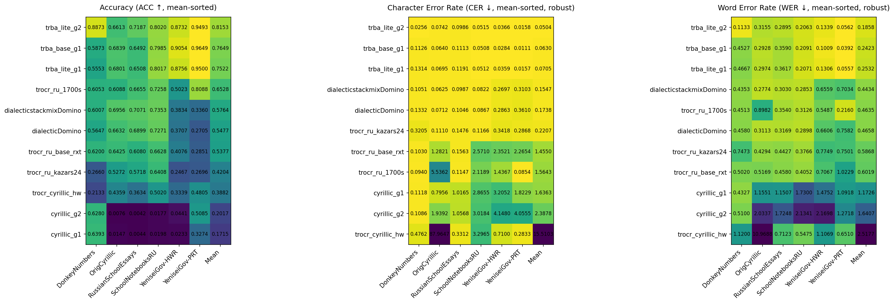

# 🏆 AzbukaBoard — Cyrillic Handwriting OCR Leaderboard

Benchmark для оценки моделей распознавания кириллического рукописного текста.

---

## Metrics Description

- **CER** (Character Error Rate) — Доля ошибочных символов. Чем меньше, тем лучше.

- **WER** (Word Error Rate) — Доля ошибочных слов. Чем меньше, тем лучше.

- **ACC** (Accuracy) — Доля полностью правильно распознанных строк. Чем больше, тем лучше.

